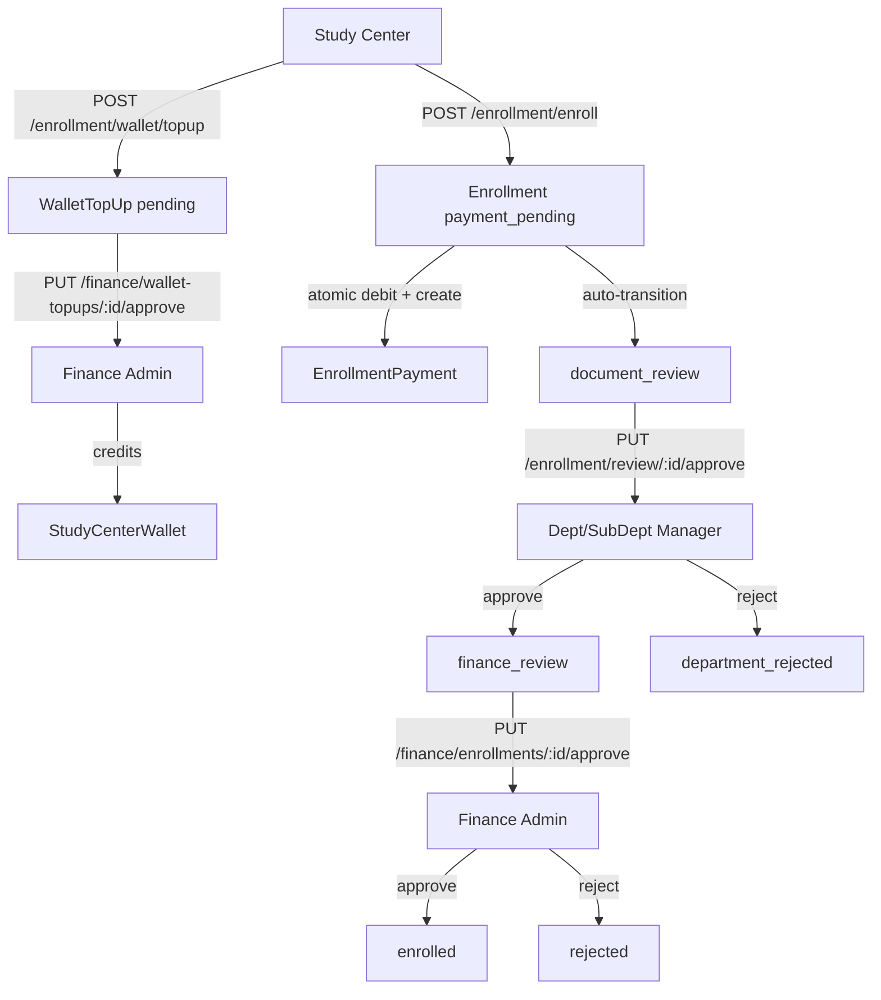

# Design Document: Student Enrollment Workflow

## Overview

The Student Enrollment Workflow introduces a structured, multi-stage pipeline for enrolling students into academic programs. The flow is:

1. **Finance** configures a `ProgramFeeStructure` per program — this gates enrollment eligibility.
2. **Study Center** tops up its wallet (payment gateway or offline bank transfer), pending Finance verification.
3. **Study Center** initiates enrollment by paying the fee from its wallet; the system atomically debits the wallet and creates an `Enrollment` record.
4. **Department/Sub-department manager** (identified by `departmentId`/`subDepartmentId` on the User model, with role `ops_admin` or `ops_sub_admin`) reviews documents and approves or rejects.
5. **Finance Admin** performs final payment verification and grants official `enrolled` status, activating the linked Student record.

The feature introduces five new Mongoose models (`ProgramFeeStructure`, `StudyCenterWallet`, `WalletTopUp`, `Enrollment`, `EnrollmentPayment`), new API routes, and new frontend panels integrated into the existing Finance Dashboard, a new Study Center Dashboard page, and the Operations Dashboard.

---

## Architecture



### Key Architectural Decisions

- **Wallet atomicity**: Wallet debit and Enrollment creation use a MongoDB session/transaction to guarantee atomicity. If either fails, both roll back.
- **Department manager identification**: There is no `dept_manager` role. Managers are identified by matching `req.user.departmentId` or `req.user.subDepartmentId` against the program's `subDepartmentId` (or the department that owns the sub-department). The middleware checks this at the controller level.
- **Fee structure gate**: The enrollment endpoint queries `ProgramFeeStructure` before proceeding; no fee structure = 400 error.
- **Status machine enforcement**: All status transitions are validated against a static allowed-transitions map before any write occurs.
- **Enrollment number generation**: Auto-generated as `ENR-{YYYYMMDD}-{6-digit-padded-count}` using a pre-save hook.

---

## Components and Interfaces

### Backend Components

#### New Controllers

| Controller | File | Responsibility |
|---|---|---|
| `enrollmentController` | `server/src/controllers/enrollmentController.ts` | Study center wallet, top-up submission, enrollment creation, own enrollment listing |
| `enrollmentReviewController` | `server/src/controllers/enrollmentReviewController.ts` | Dept/sub-dept manager document review actions |
| `programFeeController` | `server/src/controllers/programFeeController.ts` | Finance CRUD for ProgramFeeStructure |
| `walletTopUpController` | `server/src/controllers/walletTopUpController.ts` | Finance approval/rejection of top-up requests |
| `financeEnrollmentController` | `server/src/controllers/financeEnrollmentController.ts` | Finance final enrollment approval/rejection |

#### New Routes

**`server/src/routes/enrollmentRoutes.ts`** — mounted at `/api/enrollment`

```
GET    /wallet                    — get own wallet (center_admin)
POST   /wallet/topup              — submit top-up request (center_admin)
GET    /wallet/topups             — list own top-up history (center_admin)
GET    /programs                  — list fee-configured programs (center_admin)
POST   /enroll                    — create enrollment, debit wallet (center_admin)
GET    /enrollments               — list own enrollments (center_admin)
GET    /review                    — list document_review enrollments scoped to dept (ops_admin, ops_sub_admin)
PUT    /review/:id/approve        — dept manager approves (ops_admin, ops_sub_admin)
PUT    /review/:id/reject         — dept manager rejects (ops_admin, ops_sub_admin)
```

**Additions to `server/src/routes/financeRoutes.ts`**

```
GET    /program-fees              — list ProgramFeeStructures (finance_admin)
POST   /program-fees              — create ProgramFeeStructure (finance_admin)
GET    /program-fees/:id          — get single (finance_admin)
PUT    /program-fees/:id          — update (finance_admin)
DELETE /program-fees/:id          — delete (finance_admin)
GET    /wallet-topups             — list pending top-up requests (finance_admin)
PUT    /wallet-topups/:id/approve — approve top-up (finance_admin)
PUT    /wallet-topups/:id/reject  — reject top-up with remarks (finance_admin)
GET    /enrollments               — list finance_review/enrolled/rejected (finance_admin)
PUT    /enrollments/:id/approve   — finance approves enrollment (finance_admin)
PUT    /enrollments/:id/reject    — finance rejects enrollment (finance_admin)
```

#### Department Scope Middleware

A reusable middleware `checkDeptScope` will be added to verify that the acting user's `departmentId` or `subDepartmentId` matches the program's assigned department/sub-department:

```typescript
// Pseudocode
export const checkDeptScope = async (req, res, next) => {
  const enrollment = await Enrollment.findById(req.params.id).populate('programId');
  const program = enrollment.programId;
  const user = req.user;
  
  const userSubDeptId = user.subDepartmentId?.toString();
  const userDeptId = user.departmentId?.toString();
  const programSubDeptId = program.subDepartmentId?.toString();
  
  if (userSubDeptId && userSubDeptId === programSubDeptId) return next();
  // Also check if user's dept owns the sub-dept via Department lookup
  if (userDeptId) {
    const subDept = await SubDepartment.findById(programSubDeptId);
    if (subDept?.departmentId?.toString() === userDeptId) return next();
  }
  return res.status(403).json({ success: false, message: 'Not authorized for this enrollment' });
};
```

### Frontend Components

#### Finance Dashboard additions (`ModernFinanceDashboard.tsx`)

Three new tabs added to the existing `TabsList`:

| Tab value | Component | Description |
|---|---|---|
| `program-fees` | `ProgramFeeStructurePanel` | List programs, configure fee per program |
| `wallet-topups` | `WalletTopUpsPanel` | List pending top-up requests, approve/reject |
| `enrollments-finance` | `FinanceEnrollmentsPanel` | List finance_review enrollments, approve/reject |

#### New Study Center Dashboard page

**`client/src/pages/StudyCenterDashboard.tsx`** — accessible to `center_admin` role

Tabs:
- `my-wallet` → `StudyCenterWalletPanel` (balance, top-up history, submit top-up form)
- `enroll-student` → `EnrollStudentPanel` (program picker, student details form, wallet pay)
- `my-enrollments` → `StudyCenterEnrollmentsPanel` (list with status tracking)

#### Operations Dashboard additions

New tab in the Operations dashboard:
- `enrollment-review` → `DeptEnrollmentReviewPanel` (list `document_review` enrollments for their dept/sub-dept, approve/reject with remarks)

---

## Data Models

### ProgramFeeStructure

```typescript
interface IProgramFeeStructure {
  programId: ObjectId;          // ref Program, unique per program
  organizationId: ObjectId;     // ref Organization
  billingCycle: 'per_semester' | 'per_year' | 'total';
  baseFee: number;              // >= 0
  additionalFees: Array<{
    label: string;              // non-empty
    amount: number;             // >= 0
    description?: string;
  }>;
  createdBy: ObjectId;          // ref User
  createdAt: Date;
  updatedAt: Date;
}
// Index: { programId: 1 } unique, { organizationId: 1 }
```

**Total fee calculation**: `baseFee + sum(additionalFees[].amount)`

### StudyCenterWallet

```typescript
interface IStudyCenterWallet {
  studyCenterId: ObjectId;      // ref StudyCenter, unique
  organizationId: ObjectId;     // ref Organization
  balance: number;              // default 0, always >= 0
  createdAt: Date;
  updatedAt: Date;
}
// Index: { studyCenterId: 1 } unique
```

Wallet is auto-created (upsert) when a study center first submits a top-up or when the center is activated.

### WalletTopUp

```typescript
interface IWalletTopUp {
  studyCenterId: ObjectId;      // ref StudyCenter
  organizationId: ObjectId;
  amount: number;               // > 0
  paymentMethod: 'payment_gateway' | 'offline';
  referenceNumber?: string;     // required if offline
  proofDocument?: string;       // URL, required if offline
  status: 'pending' | 'approved' | 'rejected';
  remarks?: string;             // required on rejection
  verifiedBy?: ObjectId;        // ref User (Finance Admin)
  verifiedAt?: Date;
  createdAt: Date;
  updatedAt: Date;
}
// Index: { studyCenterId: 1, status: 1 }, { organizationId: 1, status: 1 }
```

### Enrollment

```typescript
interface IEnrollment {
  enrollmentNumber: string;     // unique, auto-generated: ENR-YYYYMMDD-XXXXXX
  studentName: string;
  studentEmail: string;
  studentPhone: string;
  studentAddress: string;
  programId: ObjectId;          // ref Program
  studyCenterId: ObjectId;      // ref StudyCenter
  organizationId: ObjectId;
  status: 'payment_pending' | 'document_review' | 'department_approved' |
          'department_rejected' | 'finance_review' | 'enrolled' | 'rejected';
  departmentRemarks?: string;
  financeRemarks?: string;
  departmentReviewedBy?: ObjectId;   // ref User
  departmentReviewedAt?: Date;
  financeReviewedBy?: ObjectId;      // ref User
  financeReviewedAt?: Date;
  enrolledAt?: Date;
  statusHistory: Array<{
    status: string;
    actorId: ObjectId;          // ref User
    timestamp: Date;
    remarks?: string;
  }>;
  createdAt: Date;
  updatedAt: Date;
}
// Index: { studyCenterId: 1, status: 1 }, { programId: 1, status: 1 }, { organizationId: 1, status: 1 }
// enrollmentNumber: unique index
```

**Valid status transitions** (enforced as a constant map):

```typescript
const VALID_TRANSITIONS: Record<string, string[]> = {
  payment_pending:     ['document_review'],
  document_review:     ['finance_review', 'department_rejected'],
  finance_review:      ['enrolled', 'rejected'],
  department_rejected: [],   // terminal
  enrolled:            [],   // terminal
  rejected:            [],   // terminal
};
// Note: 'department_approved' is an intermediate internal state not used in the main flow
```

### EnrollmentPayment

```typescript
interface IEnrollmentPayment {
  enrollmentId: ObjectId;       // ref Enrollment
  studyCenterId: ObjectId;      // ref StudyCenter
  walletId: ObjectId;           // ref StudyCenterWallet
  amount: number;
  debitedAt: Date;
  createdAt: Date;
  updatedAt: Date;
}
// Index: { enrollmentId: 1 } unique, { studyCenterId: 1 }
```

---

## Correctness Properties

*A property is a characteristic or behavior that should hold true across all valid executions of a system — essentially, a formal statement about what the system should do. Properties serve as the bridge between human-readable specifications and machine-verifiable correctness guarantees.*

### Property 1: Fee structure validation

*For any* ProgramFeeStructure creation request, the system should accept it if and only if the billing cycle is one of `per_semester`, `per_year`, or `total`, the base fee is non-negative, and all additional fees have non-empty labels and non-negative amounts; any request violating these constraints should be rejected with a validation error.

**Validates: Requirements 1.1, 1.2, 1.3, 1.4, 1.5, 1.6**

### Property 2: Fee structure update round-trip

*For any* existing ProgramFeeStructure, updating it with a new valid billing cycle, base fee, and additional fees list should result in the stored record reflecting exactly the submitted values when subsequently retrieved.

**Validates: Requirements 1.7**

### Property 3: Program visibility gate

*For any* set of programs, querying enrollment-eligible programs should return exactly those programs that have an associated ProgramFeeStructure, and no others — regardless of whether fee structures are added or removed.

**Validates: Requirements 1.8, 2.1, 2.2, 2.3**

### Property 4: Top-up pending does not credit wallet

*For any* WalletTopUp request in `pending` status, the associated StudyCenterWallet balance should remain unchanged from its value before the request was submitted.

**Validates: Requirements 3.5**

### Property 5: Top-up approval credits exact amount

*For any* pending WalletTopUp with amount `A`, approving it should result in the wallet balance increasing by exactly `A` (balance_after = balance_before + A) and the top-up status transitioning to `approved`.

**Validates: Requirements 3.6, 3.9**

### Property 6: Top-up rejection leaves wallet unchanged

*For any* pending WalletTopUp, rejecting it with a non-empty remarks string should leave the wallet balance unchanged and transition the top-up status to `rejected`.

**Validates: Requirements 3.7, 3.9**

### Property 7: Wallet balance invariant

*For any* enrollment attempt where the total fee is `F` and the current wallet balance is `B`: if `B >= F`, the enrollment should succeed and the resulting wallet balance should be exactly `B - F`; if `B < F`, the enrollment should be rejected and the wallet balance should remain `B`. The wallet balance must never be negative.

**Validates: Requirements 4.1, 4.2, 4.3, 4.9**

### Property 8: EnrollmentPayment created on enrollment

*For any* successfully created Enrollment, querying EnrollmentPayment by that enrollment's ID should return exactly one record with the correct amount, studyCenterId, and walletId.

**Validates: Requirements 4.4**

### Property 9: Unique enrollment numbers

*For any* two distinct Enrollment records, their `enrollmentNumber` fields must be different.

**Validates: Requirements 4.7**

### Property 10: Enrollment status machine

*For any* Enrollment in status `S`, attempting a transition to status `S'` should succeed if and only if `S'` is in `VALID_TRANSITIONS[S]`; any other transition attempt should return an error and leave the status as `S`. This applies to all actors (study center, dept manager, finance admin) and all transition points.

**Validates: Requirements 3.8, 4.5, 5.2, 5.3, 5.4, 6.4, 6.6, 6.7, 7.1, 7.2**

### Property 11: Status history grows on each transition

*For any* Enrollment that undergoes a status transition, the `statusHistory` array length should increase by exactly 1, and the new entry should contain the correct new status, the actor's user ID, and a timestamp.

**Validates: Requirements 7.3**

### Property 12: Scope isolation

*For any* query by a study center operator, only enrollments belonging to that study center should be returned. *For any* query by a dept/sub-dept manager, only `document_review` enrollments for programs assigned to their department/sub-department should be returned. *For any* query by a Finance Admin, only enrollments in `finance_review`, `enrolled`, or `rejected` status scoped to their organization should be returned.

**Validates: Requirements 5.1, 5.7, 8.1, 8.2, 8.3, 8.4, 8.6**

### Property 13: Finance payment gate

*For any* Enrollment in `finance_review` status, a Finance Admin approval attempt should succeed only if an EnrollmentPayment record exists for that enrollment; if no such record exists, the system should return an error.

**Validates: Requirements 6.2, 6.3**

### Property 14: Student record activated on enrollment

*For any* Enrollment that transitions to `enrolled` status, the linked Student record (matched by studentEmail + programId + studyCenterId) should have its status set to `active` and `enrolledAt` should be set to the approval timestamp.

**Validates: Requirements 6.4, 6.5**

### Property 15: Rejection remarks preserved

*For any* Enrollment rejected by a dept manager or finance admin with remarks string `R`, subsequently retrieving that enrollment should return `R` in the corresponding remarks field (`departmentRemarks` or `financeRemarks`).

**Validates: Requirements 5.3, 5.6, 6.6**

### Property 16: Filter correctness

*For any* enrollment query with filters (status, programId, date range), all returned records should satisfy every applied filter, and no record satisfying all filters should be omitted.

**Validates: Requirements 8.5**

---

## Error Handling

| Scenario | HTTP Status | Error Message |
|---|---|---|
| Missing required enrollment fields | 400 | `"Missing required fields: [field list]"` |
| Invalid billing cycle value | 400 | `"billingCycle must be one of: per_semester, per_year, total"` |
| Negative base fee | 400 | `"baseFee must be a non-negative number"` |
| Additional fee with empty label | 400 | `"additionalFees[n].label must not be empty"` |
| Duplicate ProgramFeeStructure for program | 409 | `"A fee structure already exists for this program"` |
| Insufficient wallet balance | 400 | `"Insufficient wallet balance. Required: X, Available: Y"` |
| No ProgramFeeStructure for program | 400 | `"Program is not yet open for enrollment"` |
| Top-up amount <= 0 | 400 | `"amount must be greater than zero"` |
| Offline top-up missing proof | 400 | `"referenceNumber or proofDocument is required for offline payments"` |
| Action on non-pending top-up | 409 | `"Top-up request is not in pending status"` |
| Rejection without remarks | 400 | `"remarks is required for rejection"` |
| Invalid status transition | 409 | `"Cannot transition enrollment from [current] to [target]"` |
| Dept manager scope violation | 403 | `"Not authorized to review enrollments for this department"` |
| Finance approval without payment record | 400 | `"No payment record found for this enrollment"` |
| Transaction rollback failure | 500 | `"Enrollment creation failed. Please try again."` |

All errors follow the existing response shape: `{ success: false, message: string }`.

---

## Testing Strategy

### Unit Tests

Focus on specific examples, edge cases, and integration points:

- Fee structure validation: valid and invalid inputs for each field
- Enrollment number generation: format correctness, uniqueness across sequential creates
- Status transition map: each valid and invalid transition pair
- Wallet debit calculation: total fee = baseFee + sum(additionalFees)
- Scope filter queries: correct MongoDB query construction for each role
- Rejection remarks: stored and retrieved correctly
- Finance payment gate: approval blocked when no EnrollmentPayment exists

### Property-Based Tests

Use **fast-check** (TypeScript-compatible PBT library) for all property tests. Each test runs a minimum of **100 iterations**.

Tag format: `// Feature: student-enrollment-workflow, Property N: <property_text>`

| Property | Test Description | Generator Inputs |
|---|---|---|
| P1: Fee structure validation | Generate random fee structure inputs (valid and invalid), assert acceptance/rejection | `fc.record({ billingCycle: fc.oneof(...), baseFee: fc.float(), additionalFees: fc.array(...) })` |
| P2: Fee structure update round-trip | Create fee structure, update with random valid values, retrieve and compare | Random valid fee structure objects |
| P3: Program visibility gate | Generate programs with/without fee structures, assert only fee-configured ones appear | Random program sets with random fee structure presence |
| P4: Top-up pending no credit | Submit top-up, check wallet balance unchanged | Random positive amounts, random study centers |
| P5: Top-up approval credits exact amount | Approve top-up, assert balance_after = balance_before + amount | Random positive amounts |
| P6: Top-up rejection unchanged | Reject top-up, assert balance unchanged | Random amounts, random non-empty remarks |
| P7: Wallet balance invariant | Attempt enrollment with random balance/fee combinations, assert balance never goes negative | Random (balance, fee) pairs |
| P8: EnrollmentPayment created | Create enrollment, query payment record, assert exists with correct fields | Random valid enrollment inputs |
| P9: Unique enrollment numbers | Create N enrollments, assert all enrollment numbers are distinct | N in range [2, 50] |
| P10: Status machine | Attempt all possible transitions from each status, assert only valid ones succeed | All (currentStatus, targetStatus) pairs |
| P11: Status history grows | Perform valid transition, assert history length increases by 1 with correct entry | Random valid transitions |
| P12: Scope isolation | Query as each role type, assert only in-scope records returned | Random enrollment sets with mixed ownership |
| P13: Finance payment gate | Attempt finance approval with/without payment record, assert gate enforced | Random enrollment IDs with/without payment records |
| P14: Student record activated | Approve enrollment, retrieve student record, assert status = active | Random valid enrollment + student pairs |
| P15: Rejection remarks preserved | Reject with random remarks string, retrieve, assert remarks match | `fc.string({ minLength: 1 })` for remarks |
| P16: Filter correctness | Query with random filter combinations, assert all results satisfy filters | Random filter objects |

Each property-based test must include the tag comment referencing the design property number before the test definition.
